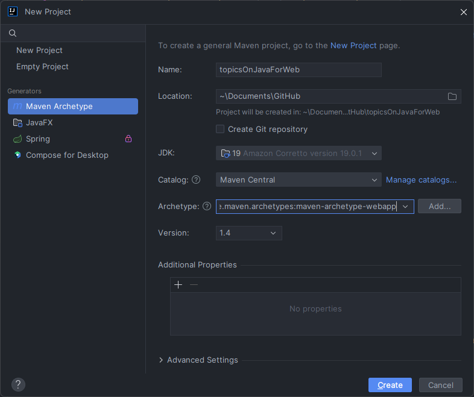

# Topicos de Java para Web

## Aulas feitas

### [Aula 1](./src/main/java/aula1)

Introducao ao servlet e setup do projeto

### [Aula 2](./src/main/java/aula2)

Recuperar parametros de requisicao com BeanUtils

### [Aula 3](./src/main/java/aula3)

Trabalhando com sessions

### [Aula 4](./src/main/java/aula4)

Usando JSP e JSP Use Bean

## Problemas no setup do projeto

### Caso Eclipse nao tenha a aba de Servers

- https://stackoverflow.com/questions/13039449/no-server-in-eclipse-trying-to-install-tomcat

1. Help -> Install New Software
2. Choose "Luna - http://download.eclipse.org/releases/luna" site
3. Expand "Web, XML, and Java EE Development"
4. Check JST Server Adapters and JST Server Adapters Extentions

### Ao criar um projeto MAVEN

Use o Archetype como:

- Group ID = org.apache.maven.archetypes
- Artifact Id = maven-archetype-webapp

### Erro comum ao criar um projeto

- https://pt.stackoverflow.com/questions/94987/como-resolver-o-erro-the-superclass-javax-servlet-http-httpservlet-was-not-f

1. Adicionar a dependencia abaixo no pom.xml

```maven
<!-- https://mvnrepository.com/artifact/javax.servlet/javax.servlet-api -->
<dependency>
    <groupId>javax.servlet</groupId>
    <artifactId>javax.servlet-api</artifactId>
    <version>3.1.0</version>
    <scope>provided</scope>
</dependency>
<!-- https://mvnrepository.com/artifact/commons-beanutils/commons-beanutils -->
<dependency>
    <groupId>commons-beanutils</groupId>
    <artifactId>commons-beanutils</artifactId>
    <version>1.9.4</version>
</dependency>
```

1. Maven -> Update Project (Alt + F5)

### Rodar o servidor dentro do Eclipse

- Windows -> Preferences -> Search on filter "Web Browser" -> Choose "Use internal web browser"

## Fazendo rodar o setup no Intellij IDEA Ultimate

### Criação do Projeto pelo IntelliJ

Ao estar no IntelliJ vá em `New -> Project... -> Maven Archetype (Generators)` como na imagem abaixo



Usando os parâmetros abaixo e escolhendo seu JDK seu projeto estará bem inicialmente

```
Catalog: Maven Central
Archetype: org.apache.maven.archetypes:maven-archetype-webapp
```

### Baixando o Apache Tomcat e instalando

Nesse link poderá baixar o [Tomcat Versão 9](https://tomcat.apache.org/download-90.cgi), basta baixar a opção de `zip` no tópico `Core:`

Nesse link o medium ensina a completar a instalação [Medium - How to set up a Tomcat server under maven project structure using **IntelliJ IDEA (macOS)**](https://medium.com/@seanliu_90343/how-to-set-up-a-tomcat-server-under-maven-project-structure-using-intellij-idea-macos-1475a975abf0)
